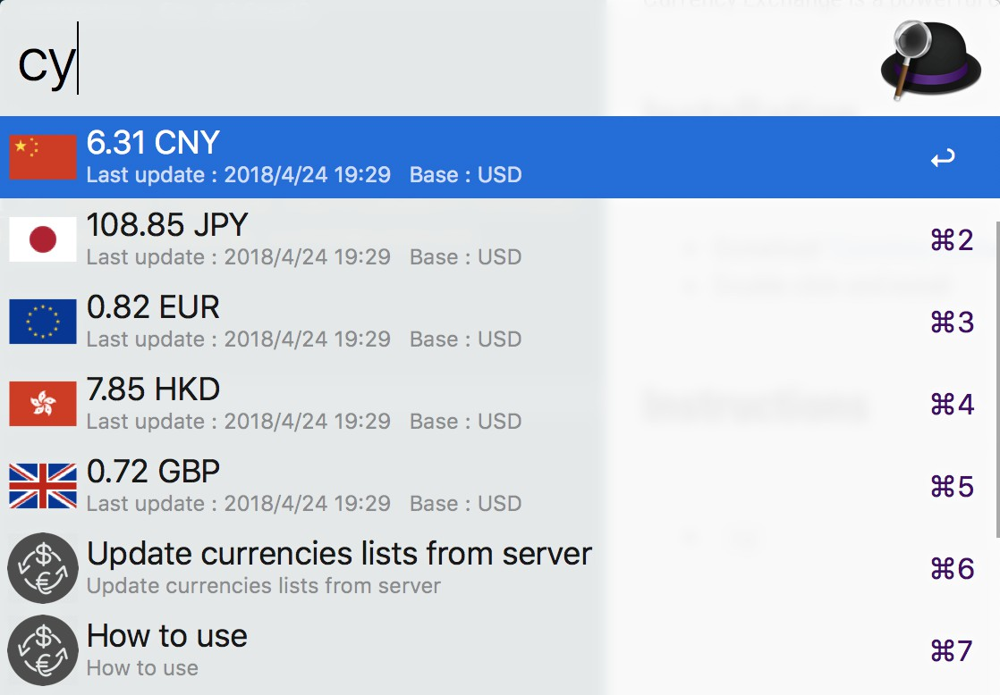
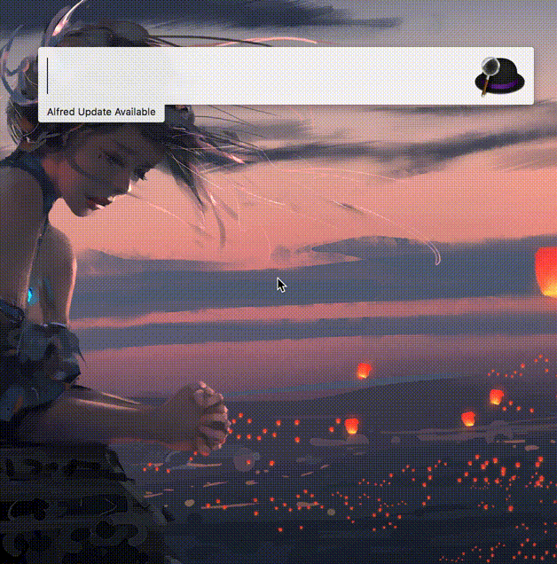
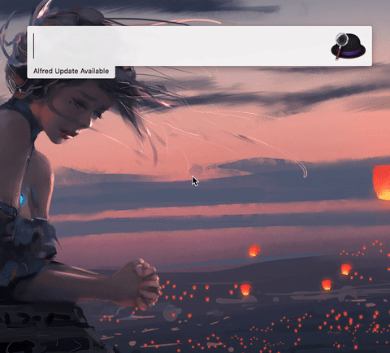
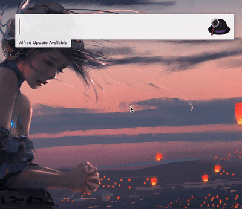
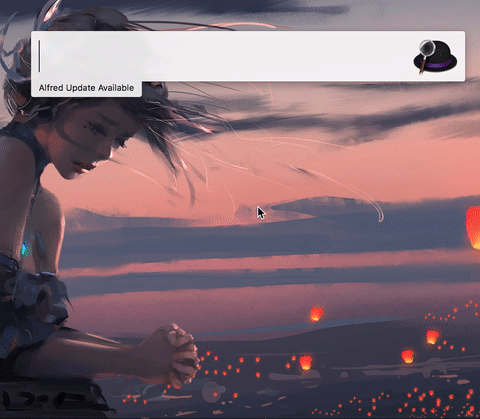
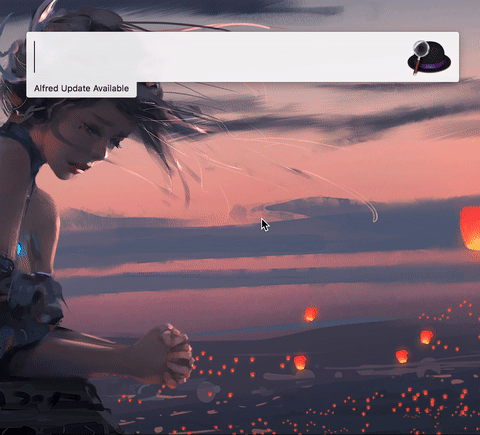

# Currency Exchange for Alfred 3

- - -

 Currency Exchange is a powerful currency convertor powered by Alfred3
 
## Potential Issues
This tool associates with [openexchangerates](https://openexchangerates.org/). Each user should have their own `APP ID` since there are limited requesting times.

I placed my `APP ID` as default, so it could be fast to reach the upper limit if you don't change it to yours.

I suggest users follow [guide1](https://github.com/FlyRabbit/alfred3-workflow-CurrencyX/issues/9#issuecomment-586383365) to register their own `APP ID` and follow [guide2](https://github.com/plummm/alfred3-workflow-CurrencyX/issues/10#issue-615729368) to replace mine.

 
## Installation

- Install python (For macOS Monterey 12.3 or higher version): ["download"](https://www.python.org/ftp/python/2.7.18/python-2.7.18-macosx10.9.pkg)

- Donwload ["Currency Exchange for Alfred 3"](https://github.com/FlyRabbit/alfred3-workflow-CurrencyX/releases)
- Double click and install

## Features
- Support cryptocurrencies, BTC, ETH, etc.
- Support most of currencies in the world
- Display with a customizable plane

## Instructions

Default base currency is *USD*

- `cy`

Convert 1 USD(the base currency) to other currencies on the panel.

_ _ _

- `cy [value]`

Convert 5.5 USD(the base currency) to other currencies on the pane

- - -

- `cy [currency]`

Convert 1 BTC to other currencies on the panel

- - -

- `cy [value][currency]`

Convert 5.5 BTC to other currencies on the panel

- - -

- `cy [value] [currency]`

Convert 5.5 USD(the base currency) to THB

- - -

- `cy [currency] [currency]`

Convert 1 BTC to CNY

- - -

- `cy-add [currency]`

Add THB to the panel

- - -

- `cy-del [currency]`

Remove THB from the panel

- - -

- `cy-base [currency]`

Set CNY as the base currency

- - -

- `cy-update`

Update currencies list from remote

- - -

- `cy-help`

Show you how to use

## Support Currencies

- AUD
- BGN
- BRL
- BTC
- BTS
- CAD
- CHF
- CNY
- CZK
- DASH
- DKK
- DOGE
- EMC
- ETH
- EUR
- FCT
- GBP
- HKD
- HRK
- HUF
- IDR
- ILS
- INR
- JPY
- KRW
- LTC
- MXN
- MYR
- NMC
- NOK
- NXT
- NZD
- PHP
- PLN
- PPC
- RON
- RUB
- SEK
- SGD
- THB
- TRY
- USD
- VTC
- XMR
- XRP
- ZAR
- AED
- AFN
- ANG
- ARS
- AWG
- AZN
- BAM
- BBD
- BDT
- BHD
- BIF
- BMD
- BND
- BOB
- BSD
- BTN
- BWP
- BZD
- CDF
- CLP
- COP
- CRC
- CUP
- CVE
- DJF
- DOP
- DZD
- EGP
- ERN
- ETB
- FJD
- FKP
- GEL
- GHS
- GIP
- GMD
- GNF
- GTQ
- GYD
- HNL
- HTG
- IQD
- IRR
- ISK
- JMD
- JOD
- KES
- KGS
- KHR
- KMF
- KPW
- KWD
- KYD
- KZT
- LAK
- LBP
- LKR
- LRD
- LTL
- LYD
- MAD
- MDL
- MGA
- MKD
- MMK
- MNT
- MOP
- MRO
- MUR
- MVR
- MWK
- MZN
- NAD
- NGN
- NIO
- NPR
- OMR
- PEN
- PGK
- PKR
- PYG
- QAR
- RSD
- RWF
- SAR
- SBD
- SHP
- SLL
- SOS
- SRC
- SRD
- STD
- SVC
- SYP
- SZL
- TJS
- TND
- TOP
- TTD
- TWD
- TZS
- UAH
- UGX
- UYU
- UZS
- VEF
- VND
- VUV
- WST
- XAF
- XCD
- XOF
- XPF
- YER
- ZMW
